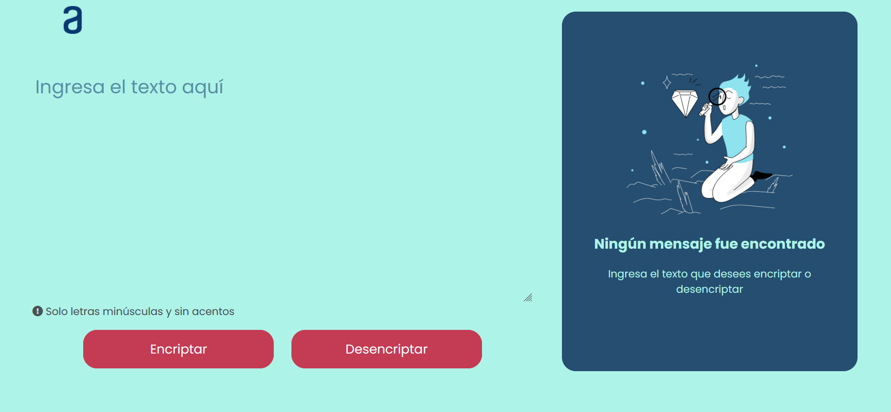

# Challenge 1 - Encriptador de texto con JavaScript

Se derrollo una aplicación que encripta textos, por medio de:  

## 📄 Requisitos 
---
- Las "llaves" de encriptación que utilizaremos son las siguientes:
    
        La letra "e" es convertida para "enter"
        La letra "i" es convertida para "imes"
        La letra "a" es convertida para "ai"
        La letra "o" es convertida para "ober"
        La letra "u" es convertida para "ufat"

- Debe funcionar solo con letras minúsculas
- No deben ser utilizados letras con acentos ni caracteres especiales
- Debe ser posible convertir una palabra para la versión encriptada también devolver una palabra encriptada para su versión original.

Por Ejemplo:

        "gato" => "gaitober"
        gaitober" => "gato"

- La página debe tener campos para inserción del texto que será encriptado o desencriptado, y el usuario debe poder escoger entre as dos opciones
- El resultado debe ser mostrado en la pantalla
- Un botón que copie el texto encriptado/desencriptado para la sección de transferencia, o sea que tenga la misma funcionalidad del ctrl+C o de la opción "copiar" del menú de las aplicaciones

## 📝 Maquetado
---
### 💻 Maquetado en Escritorio

### 📱 Maquetado en Tablet

### 📱 Maquetado en Celular

## 👾 Resultado
---
### Resultado de diseño con respecto al maquetado

### Al presionar los botones, y en caso de que el usuario no haya ingresado un texto, aparecerá la siguiente alerta

### Y en caso de que el usuario ingrese un texto en no minúsculas o letras con acentos, aparecerá la siguiente alerta

### Funcionamiento de desencriptar texto

###  Funcionamiento de encriptar texto

###  Funcionamiento de encriptar texto

### Al momento de presionar el botón de copiar, aparecerá la siguiente alerta y se guarda el texto en el portapapeles
